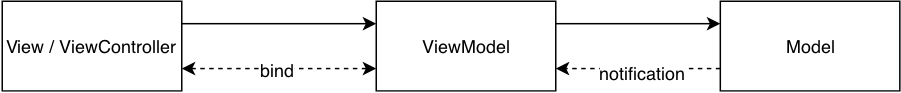
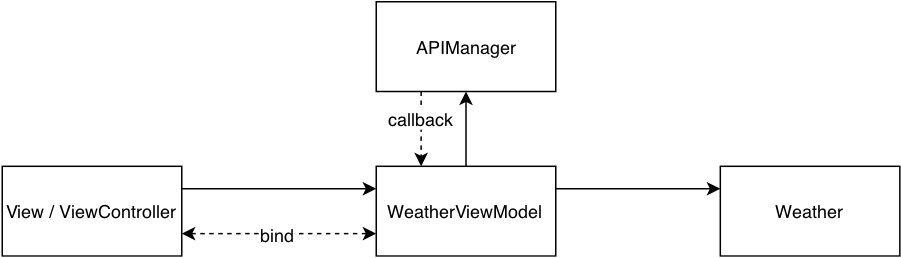

# MVVM Introduction

MVVM is one of the popular architecture patterns (MVC/MVVM/Clean/VIPER) in today's iOS app development. MVVM tend to resolve the problem of MVC and provide more cleaner architecture. All architectures has it's pros and cons, I will focus on MVVM and introduce with this demo project.

The problem in MVC is we used to write view logic as well as model logic in view controllers and making view controller too complex. In MVVM

In MVVM we only do things related to the view like layout, configure UI components, animation etc. ViewModel provide a set of properties which represents the UI components in the view. We usually use [binding](https://github.com/chronicqazxc/simple-reactive) to connect UI components to the ViewModel properties. Hence we deal with the business logic in the ViewModel and the View will changes it accordingly.

## MVVM Flow.
1. View bind to ViewModel.
2. ViewModel received user interaction from View.
3. ViewModel request data and update Model, the View will be updated accordingly.

## Demo
  
  

## Pros and Cons
Following table shows the pros and cons of MVVM.  
Pros  
* Better testing abilities.
* Seperated responsibilities.
Cons  
* Increased code size.
* Many interfaces in ViewModel.

## Conclution:
1. We only do UI initilization, binding, animation in the View components.
2. We will deal with business logic, data propagation and error handle in ViewModel.
3. Suggest to adopt MVVM for projects in middle or large scale which being developed by a big team. 

Auther: Wayne Hsiao chronicqazxc@gmail.com
